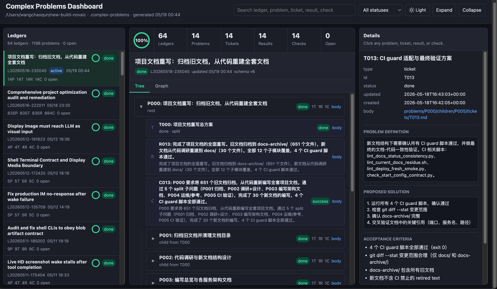

# recursive-closure-skill

[English](README.md) | [中文](README.zh-CN.md)

An AI coding agent skill for solving complex problems with recursive closure, strict success checks, action-scoped worker instructions, and a filesystem-backed problem ledger.

Works with any AI coding agent that supports skill/instruction files (Claude Code, Codex CLI, etc.).




## Installation

### Let Your Agent Install It

Paste this to your AI coding agent (Claude Code, etc.):

> Clone https://github.com/chriswangcq/recursive-closure-skill and install it to your skills directory.

The agent will run something like:

```bash
git clone https://github.com/chriswangcq/recursive-closure-skill ~/.claude/skills/recursive-closure-skill
```

Then invoke the skill in any conversation with `/recursive-closure-skill`.

### Claude Code (CLI / Desktop / Web)

Manual installation — symlink or clone into the skills directory:

```bash
# Option A: clone directly
git clone https://github.com/chriswangcq/recursive-closure-skill ~/.claude/skills/recursive-closure-skill

# Option B: symlink a local clone
git clone https://github.com/chriswangcq/recursive-closure-skill /path/to/recursive-closure-skill
ln -s /path/to/recursive-closure-skill ~/.claude/skills/recursive-closure-skill
```

Then invoke the skill in any conversation with `/recursive-closure-skill`.

Claude Code is available as a CLI (`npm install -g @anthropic-ai/claude-code`), a desktop app (macOS / Windows), a web app (claude.ai/code), and IDE extensions for VS Code and JetBrains.

### Codex CLI (OpenAI)

Add the `SKILL.md` contents to your Codex agent instructions:

```bash
# Option A: reference via instructions file
codex --instructions /path/to/recursive-closure-skill/SKILL.md

# Option B: add to your project's codex configuration
cp /path/to/recursive-closure-skill/SKILL.md .codex/instructions/recursive-closure-skill.md
```

Install Codex CLI: `npm install -g @openai/codex`

### Cursor

Add this repository as a Cursor rule:

1. Open Cursor Settings (Cmd+Shift+J / Ctrl+Shift+J)
2. Go to **Rules** → **Project Rules**
3. Create a new rule file `.cursor/rules/recursive-closure-skill.mdc` and paste the contents of `SKILL.md`

Or reference the skill directory in your `.cursorrules` file.

### Windsurf

Add the skill as a Windsurf rule:

1. Create `.windsurfrules` in your project root (or use global rules at `~/.windsurf/rules/`)
2. Paste the contents of `SKILL.md` into the rules file

### Cline (VS Code Extension)

Add the skill as a custom instruction:

1. Open Cline settings in VS Code
2. Go to **Custom Instructions**
3. Paste the contents of `SKILL.md` into the custom instructions field

Or create a `.clinerules` file in your project root with the `SKILL.md` contents.

### Roo Code (VS Code Extension)

Add the skill as a custom instruction:

1. Open Roo Code settings in VS Code
2. Go to **Custom Instructions**
3. Paste the contents of `SKILL.md`

Or create a `.roo/rules/recursive-closure-skill.md` file in your project.

### Other Agents

Point your agent's instruction/skill loader at `SKILL.md` in this repository. The skill is agent-agnostic — any agent that can follow structured instructions and run shell commands can drive the ledger loop.

## Overview

Core loop: create a problem, create and define its schema-v6 solution ticket, classify the ticket as `one_go` or `split`, execute or recurse through subproblems, record results, then close the original problem only through `check_success`.

`one_go` means one bounded execution attempt before checking, not guaranteed one-shot success. Do not choose it lightly: it is for genuinely small, concrete, low-risk work that can be verified immediately. During execution, a `one_go` ticket may spawn a blocking runtime child problem if the agent discovers a needed subprogram. Partial or failed attempts still become results; `check_success` creates follow-up problems when gaps remain.

This repo intentionally does not support legacy ticket fields such as `objective`, `scope`, or `expected_result`; the ledger script rejects non-v6 state. Delete or reinitialize old ledgers instead of migrating them.

Every problem, ticket, result, and check is written as a Markdown body file. `state.json` stores IDs, statuses, and relations; Markdown stores the semantic content.

## Responsibility Split

The system has four roles:

- **State Machine**: the CLI automaton, state transition guardrail, relation checker, and audit ledger.
- **Root Agent**: the loop driver that calls `next`, dispatches the current action, records outputs, and keeps closure moving.
- **Worker Agent**: the executor that handles the concrete `next_instruction` work.
- **Markdown bodies**: rich semantic content for tickets, results, checks, and problem packages.

Today the Root Agent and Worker Agent are usually the same LLM agent. The roles are separated conceptually so the system can later dispatch `next_instruction` work to separate agents without changing the state machine.

The agent always asks the CLI for the next step:

```bash
scripts/ledger.py next
```

`next` returns a short goal, boundary, command hints, and the matching `references/workers/*.md` instruction file. It schedules the runnable frontier leaf: a parent with open child or follow-up problems waits until those children close. Then the Root Agent performs or dispatches exactly that `next_action`, records the Worker Agent output through the CLI, and asks `next` again.

To view a live dashboard for any workspace with `.complex-problems`:

```bash
node scripts/render-dashboard.mjs --workspace /path/to/workspace
```

This starts an HTTP server, opens the browser, and live-reloads when ledger state changes.

## Root Agent Jobs

The Root Agent owns orchestration:

- Run `scripts/ledger.py next`.
- Read `next_action` and `next_instruction`.
- Dispatch the work to itself or a Worker Agent.
- Record worker outputs through the CLI.
- Run `next` again after each state-changing action bundle.
- Continue until `next_action=none`, then validate/render/status and report.

## Worker Agent Jobs

The Worker Agent handles work that requires understanding, judgment, or real execution. Worker instructions are split by exact `next_action` so a worker can focus on one job without absorbing the whole state machine.

Use `references/workers/index.md` as the index:

| next_action | Worker instruction |
| --- | --- |
| `create-solution-ticket` | `references/workers/create-solution-ticket.md` |
| `define-ticket` | `references/workers/define-ticket.md` |
| `classify-ticket` | `references/workers/classify-ticket.md` |
| `execute-ticket` | `references/workers/execute-ticket.md` |
| `split-ticket` | `references/workers/split-ticket.md` |
| `record-result` | `references/workers/record-result.md` |
| `check-success` | `references/workers/check-success.md` |
| `unblock-or-report` | `references/workers/unblock-or-report.md` |
| `none` | `references/workers/none.md` |

Across these action files, Worker Agent jobs include:

- Write solution tickets with problem definition, proposed solution, acceptance criteria, verification plan, risks, and assumptions.
- Classify tickets as `one_go` or `split`, preferring `split` unless the work is clearly one bounded attempt.
- Execute one-go tickets in the real workspace, spawning runtime child problems when execution discovers a blocking subprogram.
- Split complex tickets into plan-time child problems.
- Respect recursive waiting: solve open child or follow-up problems before recording parent results or checks.
- Summarize execution into result bodies.
- Run `check_success` as a reviewer by writing evidence, criteria map, execution map, stress test, residual risk, and gaps. Check `one_go` results with extra skepticism.

The important boundary is that the Worker Agent does only the current `next_action`. It does not choose the next state-machine step; that remains Root Agent plus CLI.

## CLI Automaton Logic

The CLI owns the rules that the agent must not improvise:

- Allocate IDs: `Pxxx`, `Txxx`, `Rxxx`, `Cxxx`.
- Return short `next_instruction` dispatch text and point to the matching worker instruction file.
- Enforce ticket flow: `created -> defined -> classified -> executing/splitting -> done`.
- Tickets do not have `blocked`; any completed attempt records a result and becomes `done`.
- Enforce problem flow: `todo/doing/checking/followup/done/blocked`.
- Keep one ticket per problem; follow-on attempts must be child or follow-up problems.
- Treat done problems as terminal unless a future explicit reopen command exists.
- Restrict public `set-status` to preparatory moves; terminal states are written by `result` and `check`.
- Derive ledger status from problem statuses; do not store a top-level ledger status field.
- Require Markdown body files for every problem, ticket, result, and check write.
- Require split child problems to come from `create-problem --from-ticket --mode split --from-file`; follow-ups are created only by `check --status not_success --followup-from-file`.
- Require runtime-spawned child problems to come from `create-problem --from-ticket --mode spawn --from-file` while a one_go ticket is executing.
- Require all children created from a ticket to close before that ticket can record its summary result.
- Prevent parallel follow-up fan-out; solve the open follow-up before creating another.
- Require `check --status success|not_success` to cite explicit `--result` IDs.
- Restrict check result IDs to the current problem result plus returned follow-up results.
- Allow problem `done` only through a success check.
- Validate state/body/path/relation consistency and render derived views.

In short: the Root Agent drives the loop, the Worker Agent produces content and evidence, and the CLI decides whether each move is legal.

## Quick Start

```bash
# Create a root problem body
cat > problem.md <<'EOF'
# Redesign the auth module

## Problem

The auth module mixes session management with token validation...

## Success Criteria

- Session and token logic are separated
- All existing tests pass
EOF

# Initialize a ledger
scripts/ledger.py init --from-file problem.md

# Follow the next-gated loop
scripts/ledger.py next
```

Then obey the returned `next_action`. Read the referenced `references/workers/*.md` file for detailed worker behavior, perform that single action, record it through the CLI, and run `scripts/ledger.py next` again.

## Usage

### Invoking the Skill

With Claude Code, invoke the skill directly in conversation:

```
/recursive-closure-skill redesign the auth module to separate session and token logic
/recursive-closure-skill --effort high fix all failing integration tests
/recursive-closure-skill --effort extra-high --language zh audit the payment system
```

With other agents, ensure `SKILL.md` is loaded as instructions, then ask the agent to solve a complex problem. The agent will use the ledger CLI automatically.

### The Next-Gated Loop

The core workflow is a loop driven by `scripts/ledger.py next`:

```
init → create-solution-ticket → classify-ticket → execute/split → record-result → check-success → done
```

Each `next` call returns the exact action to perform, the relevant problem/ticket context, and a pointer to the worker instruction file. The agent performs that one action, records the output, and calls `next` again.

### Managing Ledgers

```bash
# List all ledgers in the current workspace
scripts/ledger.py list

# Switch to a specific ledger
scripts/ledger.py use L20260518-001

# Check current ledger status
scripts/ledger.py status

# Validate ledger consistency
scripts/ledger.py validate

# Render derived views
scripts/ledger.py render
```

### Dashboard

View an interactive dashboard for any workspace with `.complex-problems`:

```bash
node scripts/render-dashboard.mjs --workspace .
# Opens browser automatically, live-reloads when ledger state changes
```

The dashboard includes a problem tree, progress rings, D3 force-directed graph, timeline, dark mode, and WebSocket live-reload.

## Configuration

### Effort Levels

Control classification, checking, splitting, and execution rigor with `--effort`:

```bash
scripts/ledger.py init --from-file problem.md --effort high
```

| Level | Behavior |
| --- | --- |
| `low` | Prefer `one_go`, light checks, coarse splits |
| `medium` | Default. Balanced classification and checking |
| `high` | Prefer `split`, thorough checks, fine-grained children |
| `extra-high` | Split everything, full audit checks, single-responsibility children |

### Language

Control the language of body content (titles, descriptions, criteria, evidence):

```bash
scripts/ledger.py init --from-file problem.md --language zh
```

CLI flags and field names always stay in English; only the Markdown body content is written in the specified language.

## Platform Notes

The ledger uses `fcntl.flock` for file-level locking to prevent `state.json` corruption from concurrent writes. This is a **Unix-only** API — the ledger works on macOS and Linux. Windows is not currently supported.

See `DESIGN.md` for the fuller design rationale.
